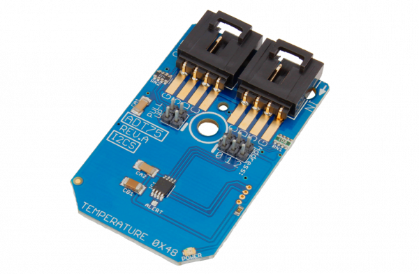

# Arduino_Library_ADT75_Temperature_Sensor

.

# ADT75
ADT75 is a Temperature Sensor ±1°C 12-Bit with 3 Address Lines I2C Mini Module.
This Device is available from www.ncd.io [SKU: ADT75_I2CS]
(https://store.ncd.io/product/adt75-temperature-sensor-%C2%B11c-12-bit-with-3-address-lines-i2c-mini-module/)
This Sample code can be used with Arduino.

Hardware needed to interface ADT75 temperature sensor with Arduino
1. <a href="https://store.ncd.io/product/i2c-shield-for-arduino-nano/">Arduino Nano</a>
2. <a href="https://store.ncd.io/product/i2c-shield-for-arduino-micro-with-i2c-expansion-port/">Arduino Micro</a>
3. <a href="https://store.ncd.io/product/i2c-shield-for-arduino-uno/">Arduino uno</a>
4. <a href="https://store.ncd.io/product/dual-i2c-shield-for-arduino-due-with-modular-communications-interface/">Arduino Due</a>
5. <a href="https://store.ncd.io/product/adt75-temperature-sensor-%C2%B11c-12-bit-with-3-address-lines-i2c-mini-module/">ADT75 Temperature Sensor </a>

## Arduino
Download and install Arduino Software (IDE) on your machine. Steps to install Arduino are provided at:

https://www.arduino.cc/en/Main/Software

Download (or git pull) the code and double click the file to run the program.
Compile and upload the code on Arduino IDE and see the output on Serial Monitor.
